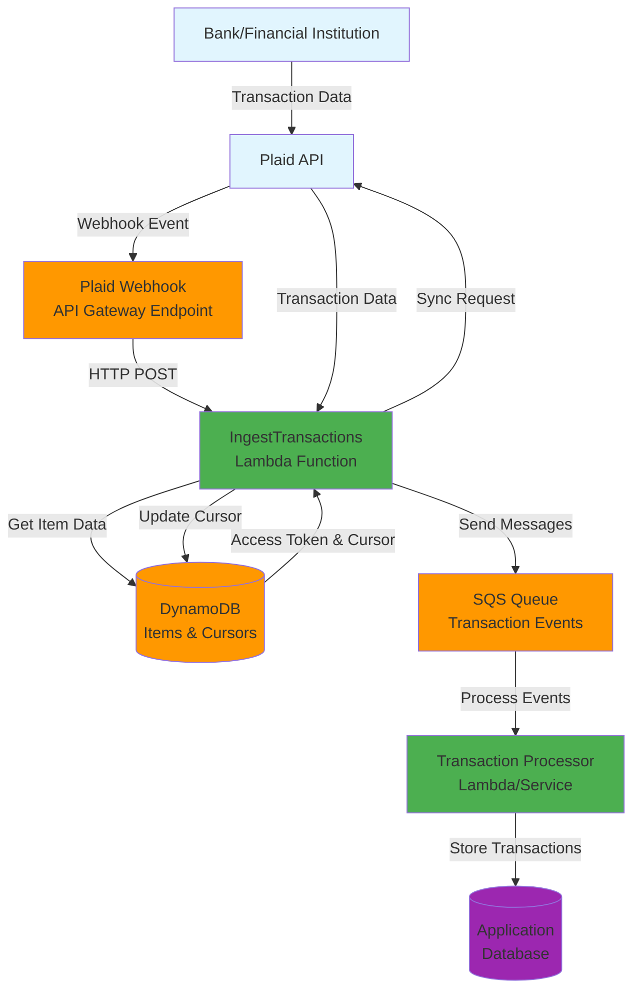
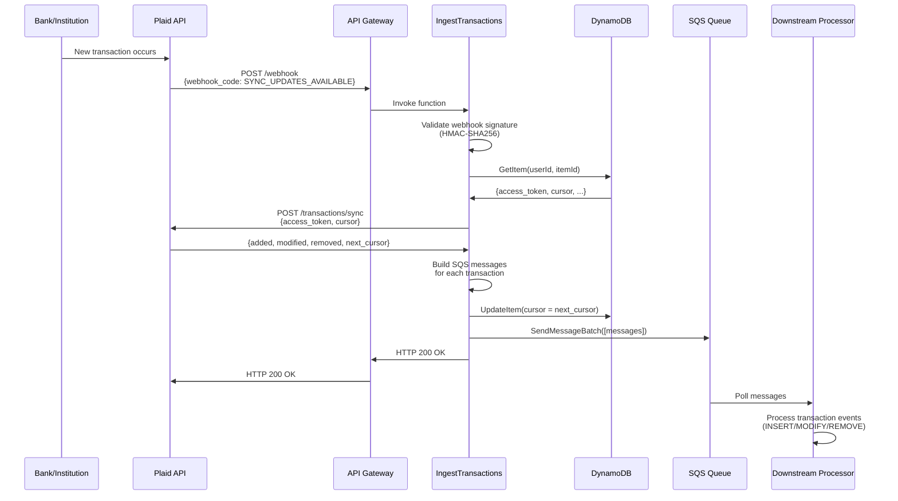
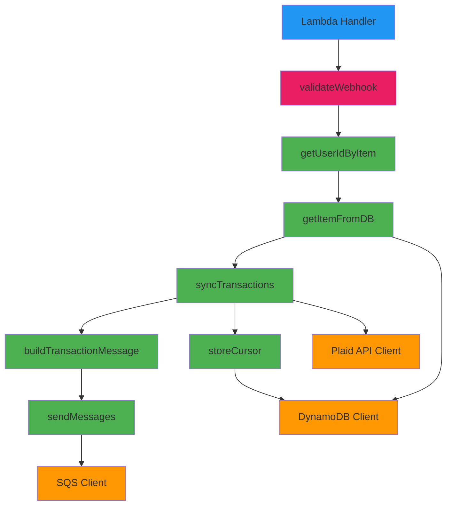
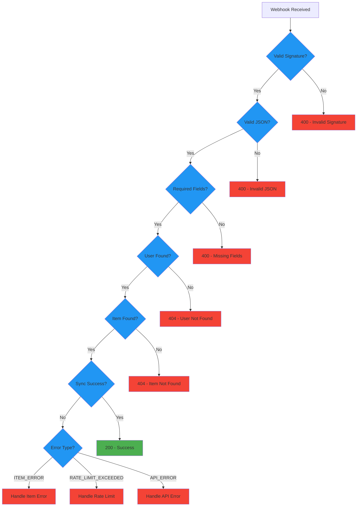
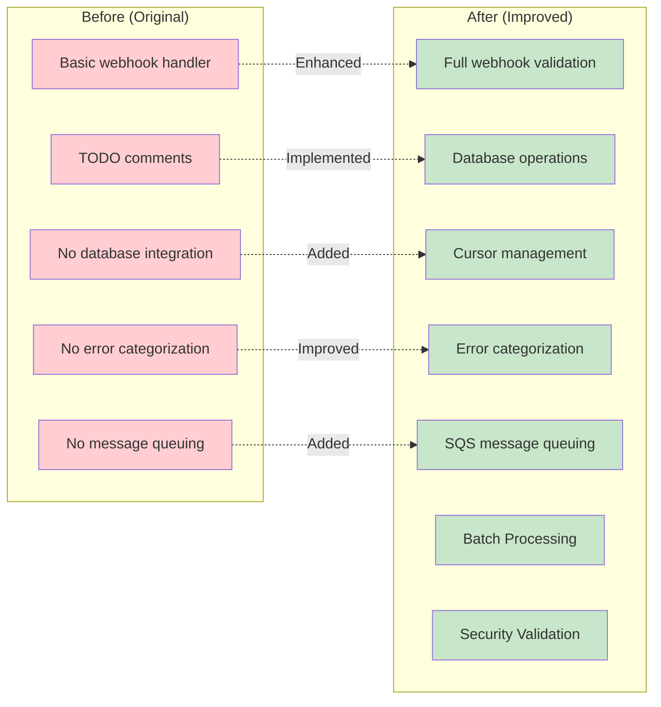

# IngestTransactions Architecture

## System Architecture Overview



## Detailed Data Flow Diagram



## Function Internal Architecture



## Data Models

```mermaid
erDiagram
    %% DynamoDB Item Structure
    ITEM {
        string pk "USER#userId#ITEM#itemId"
        string sk "v0"
        string access_token "Plaid access token"
        string cursor "Sync cursor position"
        string updated_at "ISO 8601 timestamp"
        string item_id "Plaid item ID"
        string user_id "Application user ID"
    }

    %% SQS Message Structure
    SQS_MESSAGE {
        string Id "Message ID"
        int DelaySeconds "0"
        object MessageAttributes "Metadata"
        string MessageBody "Transaction JSON"
    }

    MESSAGE_ATTRIBUTES {
        string ItemId "Plaid item ID"
        string UserId "Application user ID"
        string TransactionId "Plaid transaction ID"
        string EventName "INSERT|MODIFY|REMOVE"
    }

    %% Transaction Body Structure
    TRANSACTION_BODY {
        string pk "USER#userId#ITEM#itemId"
        string sk "TRANSACTION#transactionId"
        string gsi1pk "USER#userId#ITEM#itemId#TRANSACTIONS"
        string gsi1sk "TRANSACTION#date#transactionId"
        object transaction_data "Full Plaid transaction"
    }

    SQS_MESSAGE ||--|| MESSAGE_ATTRIBUTES : contains
    SQS_MESSAGE ||--|| TRANSACTION_BODY : contains
```

## Error Handling Flow



## Deployment Architecture

```mermaid
graph TB
    %% API Gateway
    APIGW[API Gateway<br/>Webhook Endpoint]

    %% Lambda
    subgraph "Lambda Function"
        Runtime[Node.js Runtime]
        Code[IngestTransactions Code]
        Layers[AWS SDK Layers]
    end

    %% AWS Services
    subgraph "Storage & Messaging"
        DDB[(DynamoDB Table<br/>Items & Cursors)]
        SQS[SQS Queue<br/>Transaction Events]
        CW[CloudWatch Logs]
    end

    %% IAM & Security
    subgraph "Security"
        Role[Lambda Execution Role]
        Secrets[Environment Variables]
        KMS[KMS Key<br/>Encryption]
    end

    %% External
    PlaidAPI[Plaid API<br/>External Service]

    %% Connections
    APIGW --> Runtime
    Runtime --> Code
    Code --> Layers

    Code --> DDB
    Code --> SQS
    Code --> CW
    Code --> PlaidAPI

    Role --> DDB
    Role --> SQS
    Role --> CW

    Secrets --> Code
    KMS --> DDB

    %% Styling
    classDef lambda fill:#ff9800
    classDef aws fill:#232f3e
    classDef security fill:#d32f2f
    classDef external fill:#1976d2

    class Runtime,Code,Layers lambda
    class APIGW,DDB,SQS,CW aws
    class Role,Secrets,KMS security
    class PlaidAPI external
```



## Key Improvements Summary

### 🔄 **Before vs After**



This architecture provides a robust, scalable solution for processing Plaid transaction webhooks with proper error handling, security, and downstream message processing capabilities.
